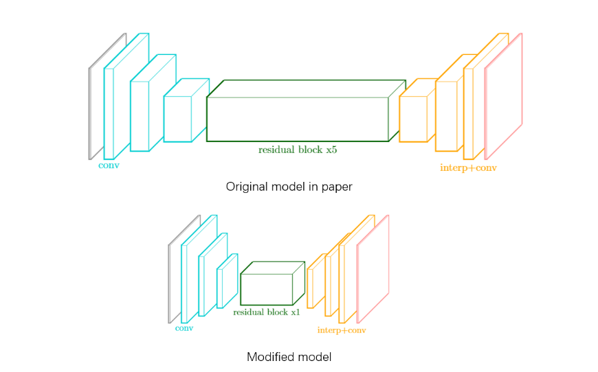

# Style Transfer -- a real-time implementation on mobile devices

[中文版本](./docs/README_ch.md)

**Introduction**

This repository contains a Pytorch-based implementation of ["Perceptual Losses for Real-Time Style Transfer and Super-Resolution"](https://arxiv.org/abs/1603.08155). We make some modifications to it to make it rearch real-time on Android devices. (It cost 30ms when the input size is 256x256 on Snapdragon 845)

___image___

 &emsp;  &emsp; 

&emsp; &emsp; &emsp; &emsp; source image &emsp; &emsp; &emsp; &emsp; &emsp; &emsp; &emsp; 
&emsp; &emsp; paper method &emsp; &emsp; &emsp; &emsp; &emsp; &emsp; &emsp; &emsp; &emsp; our method

___video___

 &emsp; 

&emsp; &emsp; &emsp; source video &emsp; &emsp; &emsp; &emsp;
style video（run it on Snapdragon845）

[download pretrain model]()

| style      | normal  |   slim  |
| --------   | -----:  | :----:  |
| udnie      |[google drive](https://drive.google.com/open?id=1-L5EDBd5ELevrNok0gpSKqVvkcd6dp1y)   |   [google drive](https://drive.google.com/open?id=1BbHY4n1dxb8ACJToypK9NGFLyE1_E4D-)     |

 

**Model architecture**

 

**Requirements**

You will need the following to run this project:

- Python3
- PIL
- Pytorch
- torchvision
- cv2 (opencv-python)
- onnxruntime (optinal)

**How to run it by yourself &ensp; (｡•ᴗ-)_**

- Preparation

  -  You should download this project and checkout your environment.
  
    - Download dataset and put it under the folder, which named **data**. Unlike in the paper,  we choose [Pascal VOC 2012](http://host.robots.ox.ac.uk/pascal/VOC/voc2012/VOCtrainval_11-May-2012.tar) instead of [Microsoft COCO](http://host.robots.ox.ac.uk/pascal/VOC/voc2012/VOCtrainval_11-May-2012.tar). If we use Microsoft COCO, we will cost more time to download it.
  
      If you use Pacal VOC 2012, you will get a folder named VOCdevkit after unpack it, put all the images in the **VOCdevkit/VOC2012/JPEGImages** under **data** folder. 
   
      If you don't want to use data foler, you can use the argument of **train.py** -- dataset to indicate the path to training set. Later, we will introduce in detail.
  -  Download pretrained [VGG16]('https://download.pytorch.org/models/vgg16-397923af.pth) and put it under the **pretrain_models**.

- Training

  - Selsect the picture you like and put it under the **style_imgs** folder. We provide 2 styles, [mosaic](./style_imgs/mosaic.jpg) and [udnie](./style_imgs/udnie.jpg).
  
  - Enter this project folder in command line mode. You can use the following code to start training your personal model:
  
    `python train.py --style_image=./style_imgs/xxx.jpg`
  
    where _xxx.jpg_ is the name of the style image which you choose
  
  If you want to do some personal settings or you don't follow above steps to set file location, [click here](./docs/train_tutorial.md) to get more details.
  
- Other

  - When you finish training, you can use **checkout.py** to view the result of your model.
 
    `python checkout.py --model_path=./models/style-transfer/xxx.pth`
   
    &emsp; where _ ./models/style-transfer/xxx.pth_ is the path to the model.
   
    &emsp; You can find more information aoubt **checkout.py**'s arguments in the code.
 
  - If you want to deploy it on mobile phone, you can use **pytorch2onnx.py** to export your model to **onnx**，then export to other formats which can run on mobile devices. You can use **checkout.py** to test your onnx file.
  
    I use [ncnn](https://github.com/Tencent/ncnn) to deploy it. You can use [this tool](https://convertmodel.com/) to convert your onnx file to the file can be recognized by ncnn. When I set thread=4 and input_size=(256, 256), slim model run on Snapdragon cost 30 ms.
   
    I still have some problems on Android that have not been resolved. So, I will provide my Android code later, when I solve all problem.
