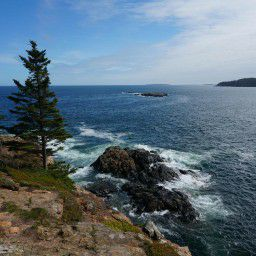
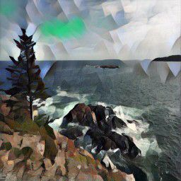
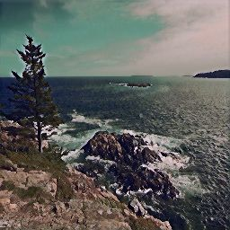

# 风格迁移 -- 移动端的实时实现

[English Version](../README.md)

**介绍**

这个项目用Pytorch来实现了论文["Perceptual Losses for Real-Time Style Transfer and Super-Resolution"](https://arxiv.org/abs/1603.08155)。 同时， 我们对原论文中的一些结构进行了修改，让它可以在安卓设备上实时的运行。（我们在骁龙845上进行了测试，当输入图片大小为256x256时，运行所花费的时间为30ms）

___image___

 &emsp;  &emsp; 

&emsp; &emsp; &emsp; &emsp; &emsp; 原图 &emsp; &emsp; &emsp; &emsp; &emsp; &emsp; &emsp; &emsp; &emsp; &emsp;
&emsp; &emsp; 论文结果 &emsp; &emsp; &emsp; &emsp; &emsp; &emsp; &emsp; &emsp; 我们修改后模型的结果

___video___

 &emsp; 

&emsp; &emsp; &emsp; &emsp; 原视频 &emsp; &emsp; &emsp; &emsp; 
&emsp; &emsp; 风格视频（运行在骁龙845）

#####download pretrain model

| 风格      | 正常的模型  |   修改后的模型  |
| --------   | -----:  | :----:  |
| udnie      |[google drive](https://drive.google.com/open?id=1-L5EDBd5ELevrNok0gpSKqVvkcd6dp1y)   |   [google drive](https://drive.google.com/open?id=1BbHY4n1dxb8ACJToypK9NGFLyE1_E4D-)     |

之后我们会提供更多的模型。

 

**模型结构**

 

**需要的环境**

- Python3
- PIL
- Pytorch
- torchvision
- cv2 (opencv-python)
- onnxruntime (可选)

**项目使用指南 &ensp; (｡•ᴗ-)_**

- 准备工作

  -  下载本项目，并检查是否满足相应的环境。
  
  - 下载训练数据集并把它放到data文件夹下。 与论文里不同， 我们选择了 [Pascal VOC 2012](http://host.robots.ox.ac.uk/pascal/VOC/voc2012/VOCtrainval_11-May-2012.tar) 来代替原论文中的 [Microsoft COCO](http://host.robots.ox.ac.uk/pascal/VOC/voc2012/VOCtrainval_11-May-2012.tar) 。 因为Microsoft COCO 太大了， 需要花费更多的时间去下载 。 
  
    如果你使用的是 Pascal VOC 2012， 当你解压该数据集后， 你会得到文件夹 VOCdevkit， 把 **VOCdevkit/VOC2012/JPEGImages** 下的所有图片放到本项目的 **data** 文件夹下即可。
   
    如果你不想使用 **data** 文件夹， 你可以在训练时使用 **train.py** 的参数 dataset 去指明训练数据集的位置。 如果对于这种用法你还不是太清楚， 我们会在后面的部分做更多的介绍。
   
  - 下载与训练好的 [VGG16]('https://download.pytorch.org/models/vgg16-397923af.pth) 并把它放到 **pretrain_models** 文件夹下。
 
- 如何训练

  - 选择你喜欢的图片作为风格图放到 **style_imgs** 文件夹下。 如果你暂时没有合适的选择， 我们提供了两种风格（ [mosaic](../style_imgs/mosaic.jpg) 和 [udnie](../style_imgs/udnie.jpg)）。
 
  - 在命令行下进入该项目的目录下， 并输入下面的代码就可以开始训练了
  
    `python train.py --style_image=./style_imgs/xxx.jpg`
	
	 &ensp;_xxx.jpg_ 是你所选择的风格图的文件名
	 
	 如果你没有按照 **准备工作** 中的步骤去做， 或者你想修改一些训练的选项， [点击这里](./train_tutorial.md) 可以了解更多。

- 其他

  - 当你训练完之后， 你可以用 **checkout.py** 去测试你的训练结果。 使用方法和 **train.py** 类似。
  
    `python checkout.py --model_path=./models/style-transfer/xxx.pth`
   
    &emsp;_./models/style-transfer/xxx.pth_ 是你训练得到的模型的路径
    
	&emsp;如果你想了解 **checkout.py** 的更多参数信息， 你可以在代码中找到。
	
  - 如果你想把它部署到移动设备上， 你可以用 **pytorch2onnx.py** 把模型文件转化为 **onnx** 形式， 再转化为可以在移动端运行的格式。 你可以用 **checkout.py** 去验证转换得到的 onnx 文件是否正确。
 
    我使用 [ncnn](https://github.com/Tencent/ncnn) 在安卓设备上进行部署。 如果你也想使用ncnn， 你可以用这个[工具](https://convertmodel.com/)， 把onnx文件转化为ncnn可以使用的格式。
   
    在安卓端我还有一些问题没有解决， 当解决了这些问题之后， 将会提供安卓相关的代码。
